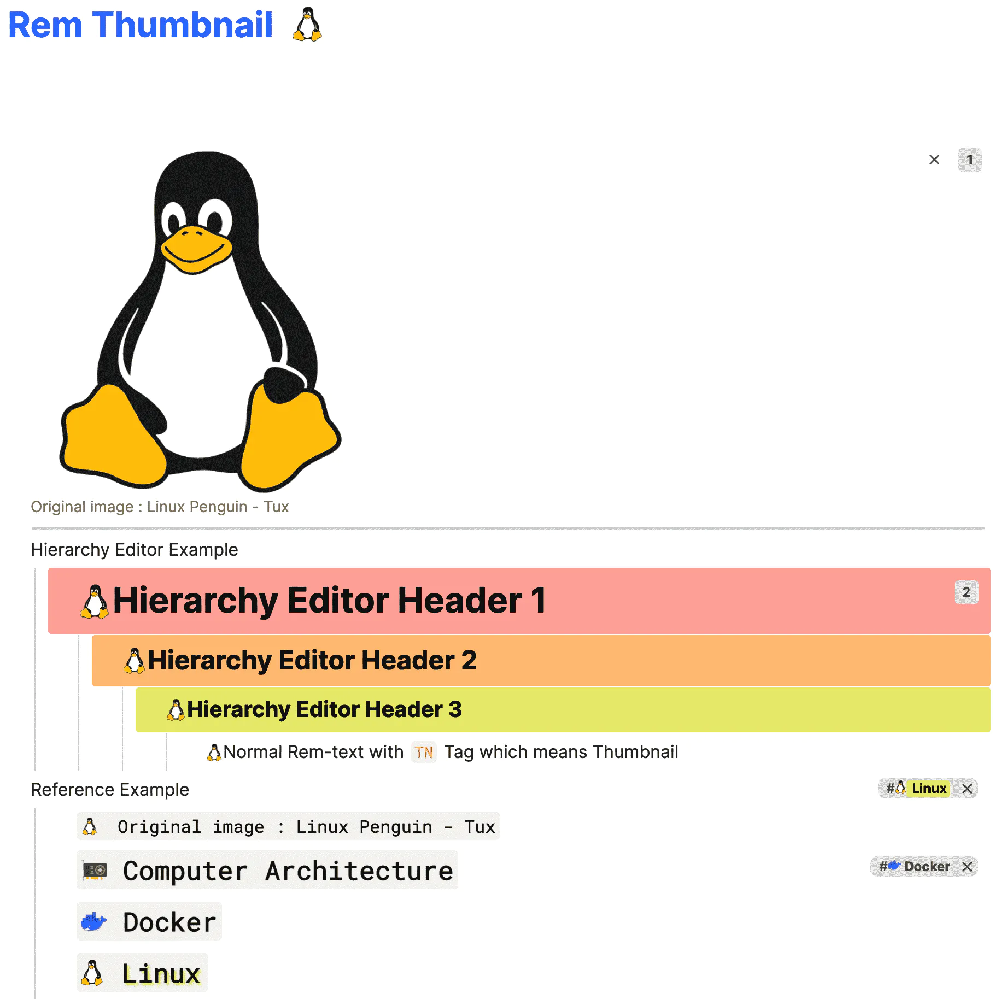

# Rem Icon

## Demo

## Usage
- Make a top-level rem named `Custom Icon` or something else easy to discern
- Just copy a 'square-shaped' image **as a reference**, and then paste it to a rem

## Need-to-Know
- Before uploading images to the server, Lowering(Compressing) image size would be preferrable for page rendering speed and optimize your local backup size and storage consumption.
- 